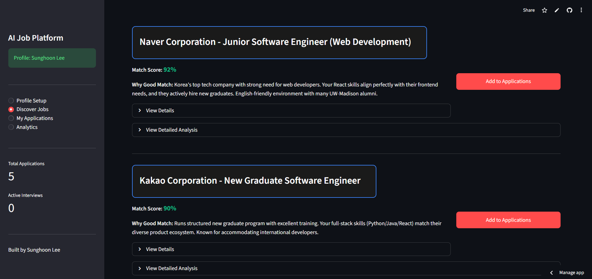
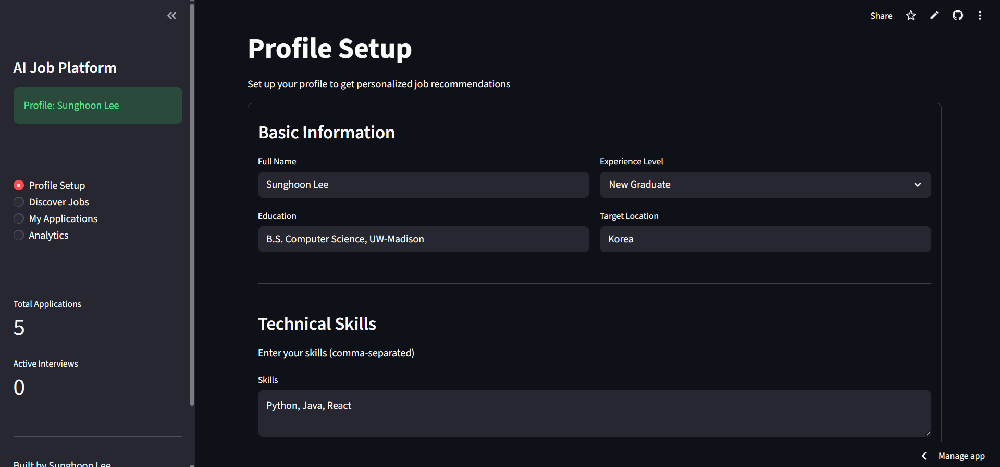
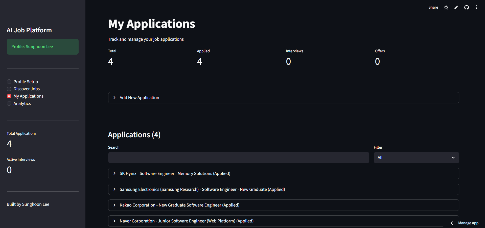
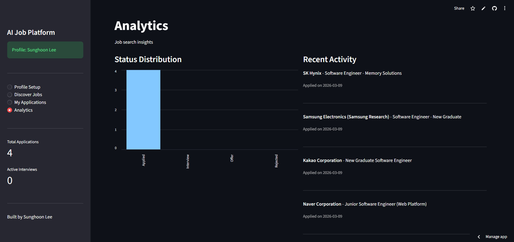

# AI Job Search Platform

🔗 **[Live Demo](https://lee-job-finder-ai.streamlit.app/)**

AI-powered job search and application management platform that helps job seekers find the best matching companies and prepare strategically.

## Screenshots

### AI Company Recommendations


### Profile Setup


### Application Tracking


### Analytics Dashboard


## Features

- **AI Company Recommendations**: Get personalized company recommendations based on your profile (up to 30 companies)
- **Intelligent Matching**: See match scores, requirements, and skill gaps for each recommended company
- **Detailed Analysis**: Generate in-depth company fit analysis and personalized learning roadmaps
- **Application Tracker**: Manage all your job applications with status tracking and search capabilities
- **Analytics Dashboard**: Visualize your job search progress with charts and insights

## Tech Stack

- **Frontend**: Streamlit
- **AI**: Claude API (Anthropic)
- **Database**: MongoDB (with in-memory fallback)
- **Python**: 3.8+

## Installation

1. Clone the repository
```bash
git clone https://github.com/leondevazel/job-search-platform.git
cd job-search-platform
```

2. Install dependencies
```bash
pip install -r requirements.txt
```

3. Set up environment variables

Create a `.env` file:
```
ANTHROPIC_API_KEY=your-api-key-here
MONGODB_URI=your-mongodb-uri (optional)
```

4. Run the application
```bash
streamlit run app.py
```

## Usage

1. **Profile Setup**: Enter your education, skills, experience level, and target positions
2. **Discover Jobs**: Get AI-powered recommendations for companies that match your profile
   - View match scores and why each company is a good fit
   - Load more recommendations (up to 30 companies)
   - Generate detailed analysis with learning roadmaps
3. **My Applications**: Track applications with status updates and search functionality
4. **Analytics**: Monitor your job search progress with visual insights

## Key Features

### Smart Recommendations
- AI analyzes your profile and recommends up to 30 companies
- Each recommendation includes match score, requirements, and skill gaps
- Load more feature for exploring additional opportunities

### Detailed Analysis
- Paste actual job descriptions for in-depth analysis
- Get personalized preparation roadmaps
- Identify specific skills to learn with estimated timelines

### Application Management
- Track all applications in one place
- Update status (Applied → Interview → Offer)
- Search and filter by company or position
- AI-powered keyword extraction from job descriptions

## Project Structure
```
├── app.py              # Main Streamlit application
├── database.py         # Database operations (MongoDB/in-memory)
├── ai_helper.py        # AI/Claude API integration
├── requirements.txt    # Python dependencies
├── screenshots/        # Application screenshots
└── README.md          # Project documentation
```

## Technologies Used

- **Streamlit**: Web application framework
- **Claude API**: AI-powered recommendations and analysis
- **MongoDB**: Data persistence (optional)
- **Python**: Backend logic

## Future Enhancements

- Real-time job posting scraping
- Email notifications for application deadlines
- Resume optimizer tool
- Interview preparation assistance

## Author

**Sunghoon Lee**
- University of Wisconsin-Madison, B.S. Computer Science (Dec 2025)
- GitHub: [leondevazel](https://github.com/leondevazel)
- LinkedIn: [Sunghoon Lee](https://www.linkedin.com/in/sunghoon-lee-767659248)

## License

This project is open source and available for educational purposes.