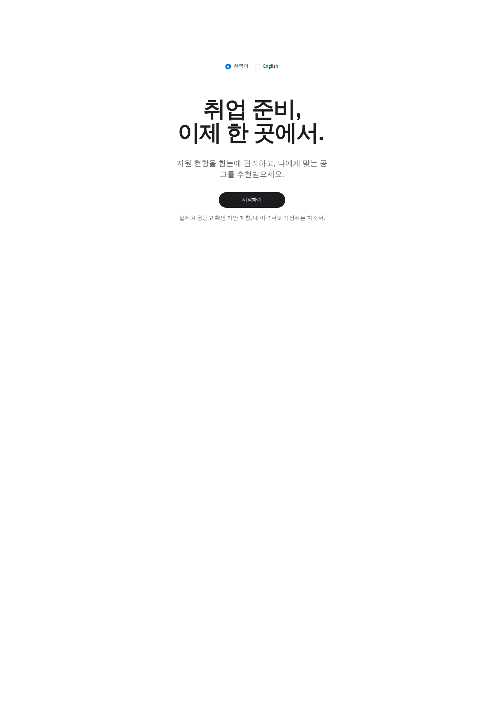
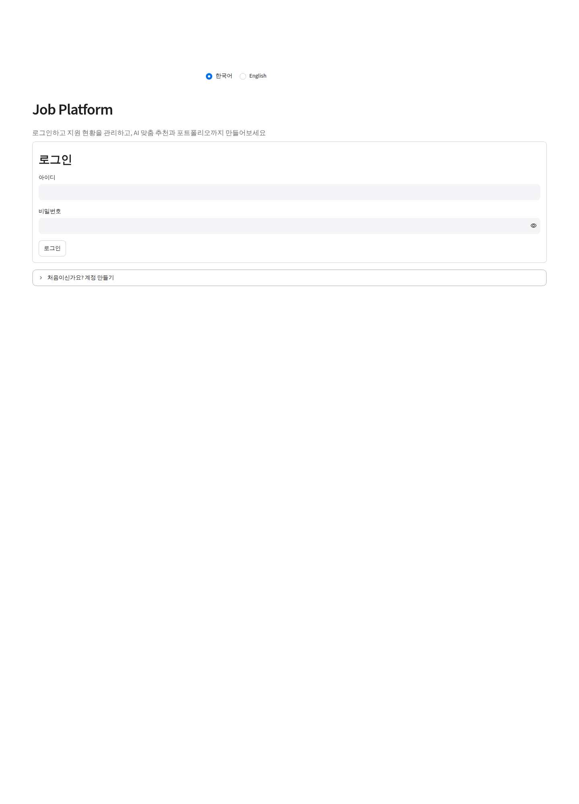
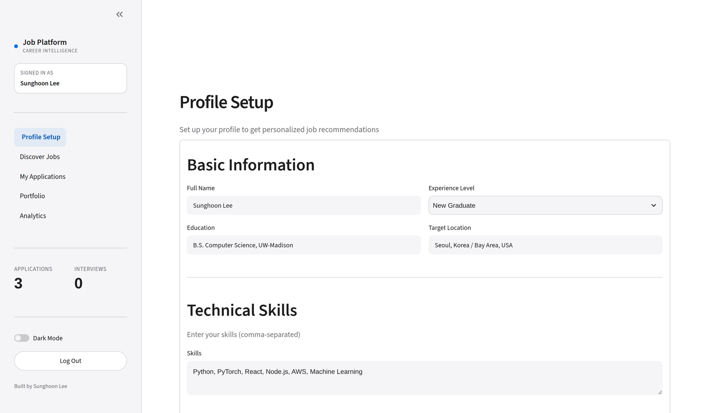
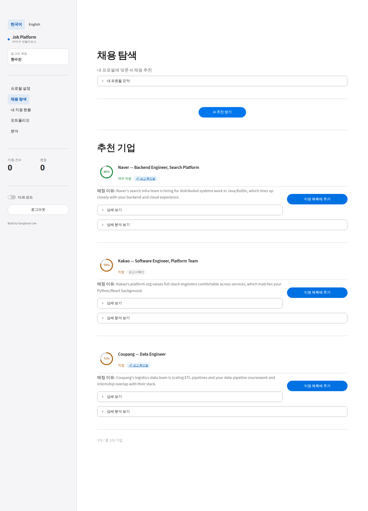
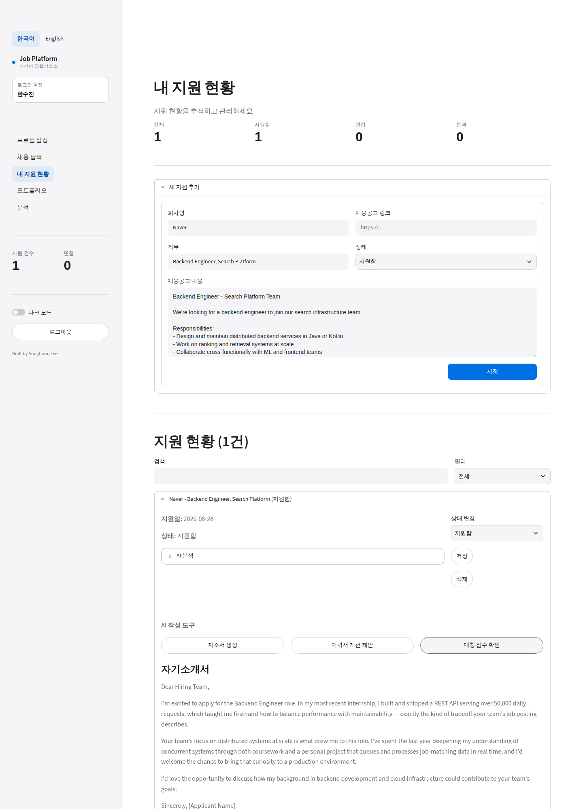
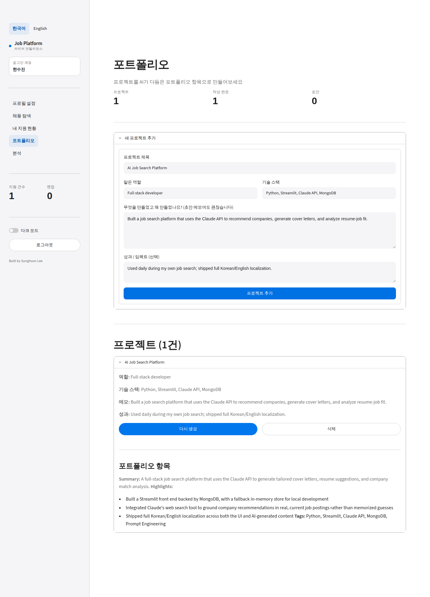
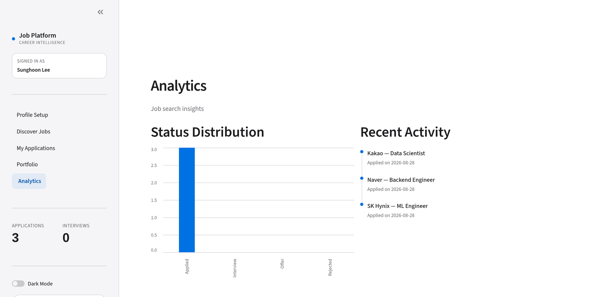

# AI Job Search Platform

🔗 **[Live Demo](https://lee-job-finder-ai.streamlit.app/)**

An AI-powered job search platform that recommends companies grounded in real, live web search — not the model's memorized guesses — and helps you track applications, tailor your resume, and build a portfolio. Fully localized in Korean and English, including the AI-generated content itself.

## Screenshots

### Landing Page


### Sign In / Register


### Profile Setup


### AI Company Recommendations


### Application Tracking & AI Writing Tools


### Portfolio


### Analytics Dashboard


## Features

- **Accounts & Auth**: Register/login with `streamlit-authenticator`, including support for one-syllable Korean names (김, 이, 박, ...)
- **Korean/English Localization**: Every screen and every AI-generated response (recommendations, cover letters, analyses) can be read in either language, switchable anywhere via a language toggle
- **Dark Mode**: Toggle from the sidebar
- **Web-Search-Grounded Recommendations**: The AI recommends up to 15 companies per request, using Claude's web search tool to actually check each company's careers page for a live posting and to look up its stated culture/values — rather than guessing. Each result shows an honest "posting confirmed" or "not confirmed" badge instead of pretending a posting exists
- **Match Scoring**: A circular score ring and fit tier (Strong / Good / Possible fit) per company, with an explicit "Score unavailable" state instead of ever showing a fabricated 0%
- **Detailed Company Fit Analysis**: Paste a real job description to get a full match breakdown and a personalized learning roadmap for closing skill gaps
- **Resume-Culture Alignment**: A dedicated tool that searches for a specific company's stated values and suggests how to reword or reprioritize your existing resume to genuinely reflect that fit — it never invents new experience
- **Application Tracker**: Add, search, filter, and update the status of every application (Applied → Interview → Offer/Rejected)
- **AI Writing Tools** (per application): generate a tailored cover letter, get resume improvement suggestions, or check a match score against the saved job description
- **Portfolio Builder**: Turn raw project notes into a polished, recruiter-ready portfolio entry
- **Analytics Dashboard**: Visualize application status distribution and recent activity

## Tech Stack

- **Frontend**: Streamlit
- **Auth**: streamlit-authenticator
- **AI**: Claude API (Anthropic), including the web search tool for grounded recommendations
- **Database**: MongoDB (with an automatic in-memory fallback for local development)
- **Python**: 3.8+

## Installation

1. Clone the repository
```bash
git clone https://github.com/leondevazel/job-search-platform.git
cd job-search-platform
```

2. Install dependencies
```bash
pip install -r requirements.txt
```

3. Set up environment variables

Create a `.env` file:
```
ANTHROPIC_API_KEY=your-api-key-here
MONGODB_URI=your-mongodb-uri (optional — falls back to in-memory storage if omitted)
```

4. Run the application
```bash
streamlit run app.py
```

## Usage

1. **Sign up / Log in**: Create an account (Korean or English names supported) from the landing page
2. **Profile Setup**: Enter your education, skills, experience level, target roles, and paste your resume as plain text
3. **Discover Jobs**: Get AI recommendations grounded in live web search
   - See a match score, fit tier, and a real posting/culture verification badge for each company
   - Expand a company for requirements, gaps, and culture notes
   - Paste a real job description for a detailed fit analysis and learning roadmap
   - Generate resume suggestions aligned to that company's specific culture
4. **My Applications**: Track every application and use the AI Writing Tools to generate a cover letter, get resume tips, or check your match score
5. **Portfolio**: Add your projects and let AI turn your raw notes into a polished write-up
6. **Analytics**: See your application status distribution and recent activity at a glance

Switch between Korean and English at any time using the language toggle — it appears on the landing page, the login screen, and the sidebar, and affects both the UI and any AI-generated text.

## Project Structure
```
├── app.py              # Main Streamlit application (auth, all 5 pages, i18n)
├── database.py         # Database operations (MongoDB/in-memory)
├── ai_helper.py         # AI/Claude API integration
├── requirements.txt    # Python dependencies
├── screenshots/        # Application screenshots
└── README.md          # Project documentation
```

## Future Enhancements

- Resume file upload (currently paste-as-text)
- Deadline reminders for open applications
- Public, shareable portfolio links
- CSV/PDF export of application history

## Author

**Sunghoon Lee**
- University of Wisconsin-Madison, B.S. Computer Science (Dec 2025)
- GitHub: [leondevazel](https://github.com/leondevazel)
- LinkedIn: [Sunghoon Lee](https://www.linkedin.com/in/sunghoon-lee-767659248)

## License

This project is open source and available for educational purposes.
